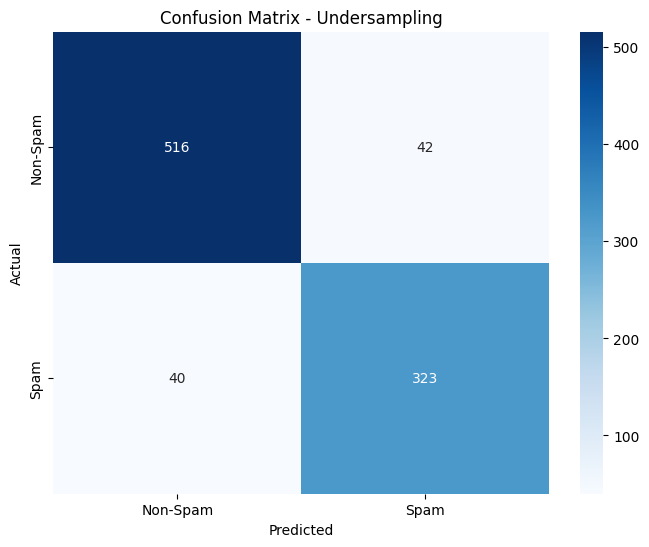

## Overview
This repository contains an implementation of various techniques to handle imbalanced datasets, specifically focusing on the classification of flower species. The dataset exhibits a significant class imbalance, with one class representing approximately 39.4% of the total samples. 

## Table of Contents
- [Introduction](#introduction)
- [Data Description](#data-description)
- [Techniques for Handling Imbalance](#techniques-for-handling-imbalance)
- [Implementation](#implementation)
- [Evaluation Metrics](#evaluation-metrics)
- [Results](#results)
- [Visualization](#visualization)
- [Conclusion](#conclusion)

## Introduction
Imbalanced datasets can lead to biased models that perform poorly on minority classes. This project implements three techniques to address this issue:
1. **Oversampling**: Increasing the number of samples in underrepresented classes.
2. **Undersampling**: Reducing the number of samples in overrepresented classes.
3. **Weighted Logistic Regression**: Assigning weights to classes in the Logistic Regression model to balance the influence of each class.

## Data Description
The dataset consists of features representing various attributes of flowers, with a target variable indicating the class (species) of each flower.

## Techniques for Handling Imbalance
### 1. Oversampling
Using `RandomOverSampler` to increase the number of samples in the minority class.

### 2. Undersampling
Using `RandomUnderSampler` to decrease the number of samples in the majority class.

### 3. Weighted Logistic Regression
Using class weights in the Logistic Regression model to mitigate the effects of class imbalance.

## Evaluation Metrics
The following metrics are reported for each technique:
- **Precision**: The accuracy of positive predictions.
- **Recall**: The ability of the model to find all relevant cases.
- **F1-Score**: The harmonic mean of precision and recall.
- **Accuracy**: The overall correctness of the model.

## Results
### Weighted Logistic Regression:
- Precision: 0.8835
- Recall: 0.8981
- F1-Score: 0.8907
- Accuracy: 0.9131

### Logistic Regression with Oversampling:
- Precision: 0.9022
- Recall: 0.8898
- F1-Score: 0.8960
- Accuracy: 0.9186

### Logistic Regression with Undersampling:
- Precision: 0.9076
- Recall: 0.8926
- F1-Score: 0.9000
- Accuracy: 0.9218

## Visualization
Here is the confusion matrix for the Logistic Regression with Undersampling:

## Conclusion
This project demonstrates effective techniques for managing imbalanced datasets, improving model performance through oversampling, undersampling, and weighted logistic regression. Further exploration could include other advanced techniques such as SMOTE or ensemble methods.
